

https://simple-mnist-classification.herokuapp.com/ 

                        

                            <h1 style="font-size: 25px; text-align: left; text-indent: 50px; margin-top: 20px; border-bottom: 3px solid #bababa; margin-left: 50px; margin-right: 50px;">Architecture scheme</h1>
                            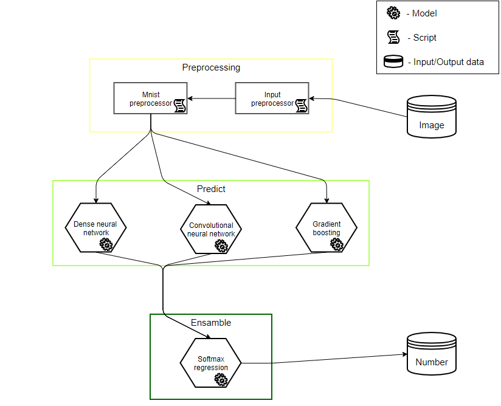
                        

                        

                            <h1 style="font-size: 25px; text-align: left; text-indent: 50px; margin-top: 20px; border-bottom: 3px solid #bababa; margin-left: 50px; margin-right: 50px;">1. Preprocessing</h1>
                            
1.1 Input Preprocessor

                            
At the beginning, the message is coming from client side, as message presented in base64 format, it convert in image. It is assumed that the image has a digit so after converting being find bounded digit, this is a rectangle with cutted borders without the parts of digit.

                            
1.2 Mnist Preprocessor

                            
After then as image has been resized, need transform it in mnist-like image, before the continue we need understand what is mnist image and how it organized?

                            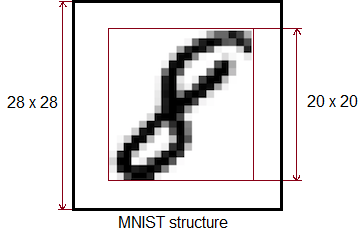
                            
As seen on illustrator, rectangle with digit takes place in middle,  supposed need resize and place bounded digit in the middle of the canvas with size 28 by 28 pixels , this is happening with bounded digit, thus the biggest side equated to 20 pixels and resized proportionaly for plasing in canvas. Second step consists in noise reduction, in cleaning excess gradation of grey and gain gradations of grey in the remaining pixels of digit.

                            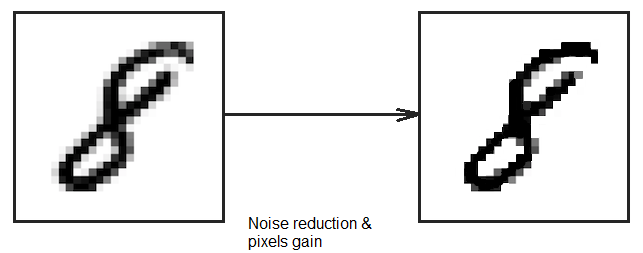
                            
Note, noise reducing produced with math present image, as matrix, each element it is number by 0 to 255 and this is gradation of gray, noise reducing operation is simple difference between each pixel of image and "noise coeficient". Last step consists in normalize matrix, this is done for avoid problems with gradient in neural networks

                        

                        

                            <h1 style="font-size: 25px; text-align: left; text-indent: 50px; margin-top: 40px; border-bottom: 3px solid #bababa; margin-left: 50px; margin-right: 50px;">2. Predict</h1>
                            
2.0 Data augmentation

                            
Mnist dataset have not really quality, some digits, namely bounded rectangles with digit, which should be located in area 20x20 pixels in 28x28 canvas, have biases, it's very undesirable for gradient boosting model and dense neural network, such dataset objects exacebate training.&nbsp;Mnist dataset undergo general preprocessing, namely:

                            
1. Extract bounded digit

                            
2. Rotate this bounded digit on 24 gradus on left and right

                            
3. Noise reducing and normalization

                            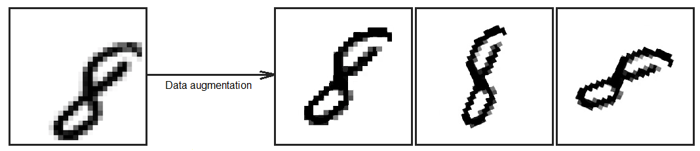
                            
2.1 Dense neural network

                            
Title of dense neural networks says for itself, this is type of neural networks, neurons for this network connect with all previous and follow neurons, but this type of neurons network is "hard" in compute terms, and it suffer a lot on afflictions related a gradient(explosive and dying gradient). Dnn created from scratch, only numpy, only hardcore:) code with dnn model for classification is located on this link, it is study project. Hyperparameters for this model selected using hyperopt, little logics when choosing, becouse hyperparameters choising automaticly on in advance on initialized range.

                            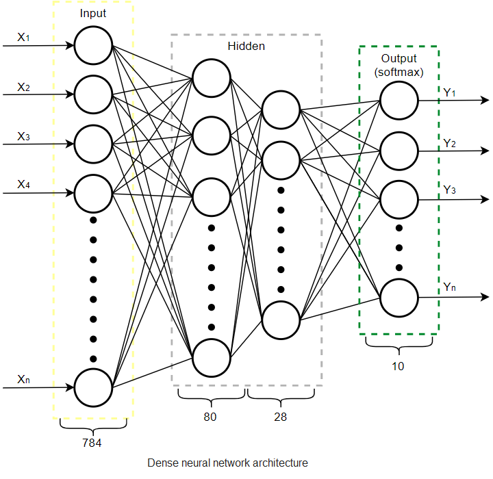
                            
* Softplus
activation function and Kullback loss function, sums in neurons using bias.

                            
Also should note technical and quality importance softmax layer, on one side it improve quality, other it support using many other activations functions, outputs which not always can present as probability, softmax allows transform non-probability activations in probability distributions. Let's see on accuracy/epochs plot

                            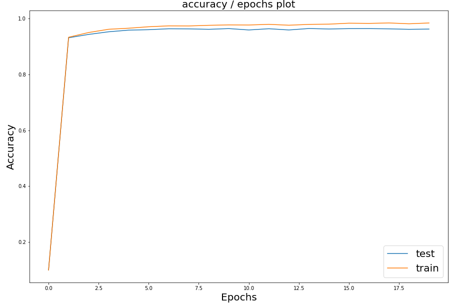
                            
As see on graphics, dnn anyway slow overfitting, optimal number of epochs is 5

                            
2.2 Convultional neural network

                            
In the paragraph above, it was written that DNNs have many and many weights, for example: dnn working with an image size of 100x100 pixels has 10,000 inputs, each neuron on the next layer will cost 10,000 weights, this neural network takes a lot of time to learn, and It doesn’t extract individual parts, but clubs.

                            
Cnn good with computer vision tasks and has a few weights. The main mechanism of this model is convulsive layers, namely the kernels(cores/filters). Cores allow you to extract objects, for example, circles (eight have 2) or curved lines of the number two. Classic cnn consists of a convolutional, unifying and fully connected (dense) layer.&nbsp; For create this network was used keras, the figure below shows the image architecture model used in the mnist classification.

                            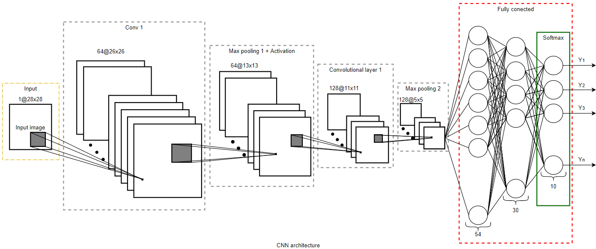
                            
* SELU activation function, loss - categorical cross entropy, filter sizes is 3(pooling and conv. layers), stride is 1&nbsp;&nbsp;

                            
But how did I get this architecture? To create this cnn, I used a VGG16-like architecture, namely, the basic idea of ​​doubling the number of filters for each convulsive layer and the number of filters should be even. Your attention is the validation plots (shows accuracy or other metrics, according to the hypermarameter data), the number is shown at the bottom of each graph, this is the stage at which the hyperparameter was obtained. Sorry for the poor image quality.

                            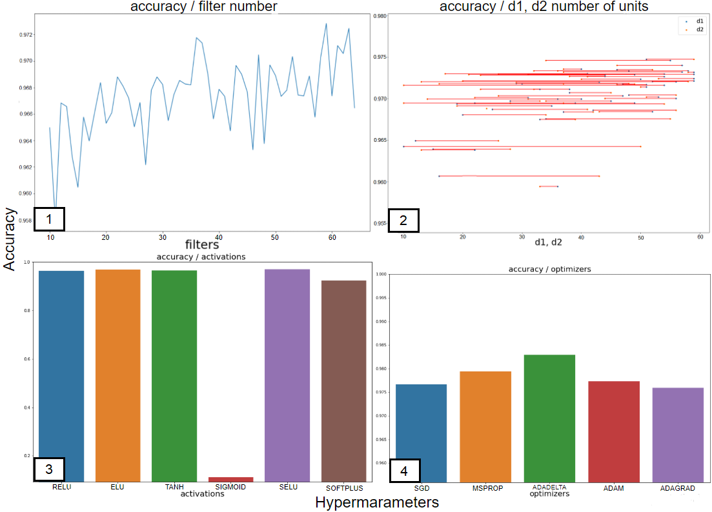
                            
Let's start:

                            
Stage 1: Selecting number of filters in convolutional layers(note, filters doubled for each next layer), at first sight may seem problem, but its normal, it is such a scale, best number of filter - 64.

                            
Stage 2: Very unusual plot, each horizontal line this plot it is architecture, interconnected dots - d1 and d2, where d1 - number of neurons on first layer in fully conected layer, d2-last layer. Best scores located, when d1 is in the range 45-60, and d2 is in range 15-35 approximately, d1-54, d2-30.

                            
Stage 3: Selecting activation for Max pooling layer and fully conected layer, best score on SELU function.

                            
Stage 4: Selecting optimizer, best score on ADADELTA, next step consist on set up parameters for optimizer(learning rate and rho), finding this parameters made using hyperopt.

                            
Accuracy / Epochs plot:

                            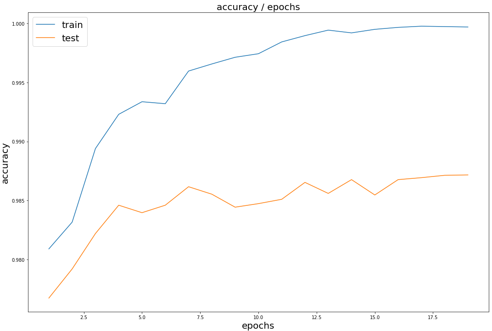
                            
Optimal number of epochs is 20

                            
2.3 Gradient boosting

                            
Boosting(in classification was used tree as basic learner) it's powerful algorithm, basic idea consist in stepwise minimize the loss function through adding new trees trained on errors the previous trees. Let's move on gradient boosting, namely on gradient, gradient it's value which when adding to function argument, maximize function and when decrease on argument minimize function. Each tree in gradient boosting machine(in classification was used lightgbm) produce gradient by which argument of the loss function decreases leading to minimization of loss function. more detailed interpretation located in at the end of the article. Finding the hypermapameters i divided them into two stages.

                            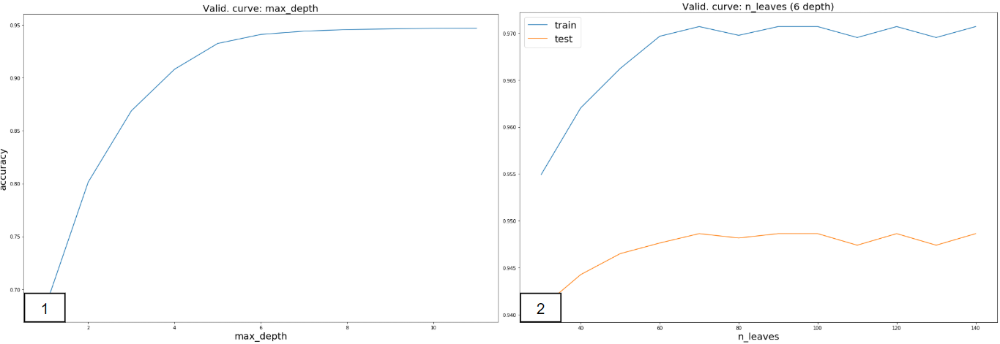
                            
Stage 1: Selecting a tree depth, best depth is 6, note, increasing this hyperparameter causes overfitting!

                            
Stage 2: Selecting number of leaves, amount leaves is 70, increasing this hyperparameter too causes overfitting.

                            
After finding the number of leaves and depth, I found (used hyperopt) reg_labmda, reg_alpha - l2 and l1 regularizers. The last step in choosing hyperparameters was to select the number of trees (n_estimators).

                            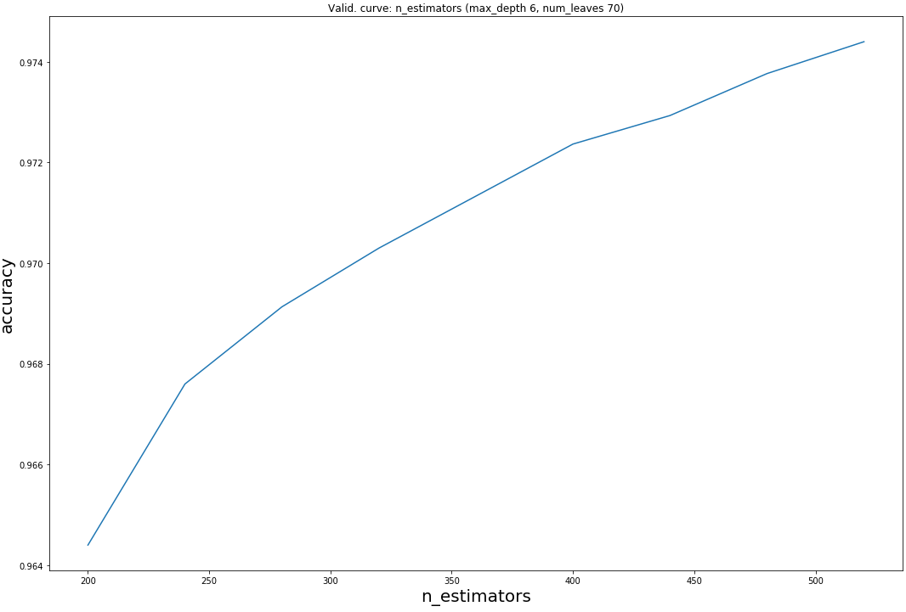
                            
Best number of trees(estimators) - 550

                        

                        

                            <h1 style="font-size: 25px; text-align: left; text-indent: 50px; margin-top: 10px; border-bottom: 3px solid #bababa; margin-left: 50px; margin-right: 50px;">3. Ensemble</h1>
                            
3.1 Method select

                            
Ensemble this is method at which for predict used several models, in classification was used stacking method. Stacking used predicts of many models(metafeatures) as train data for metamodel.

                            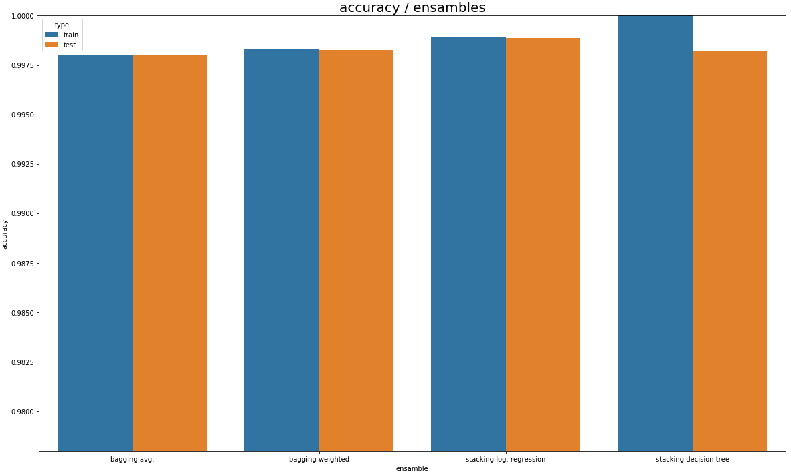
                            
Best score showed logistic regression model, tree model is overfitting(high train score, low test score), hyperparameters for logistic regression not searched.

                        

                        

                            <h1 style="font-size: 25px; text-align: left; text-indent: 50px; margin-top: 10px; border-bottom: 3px solid #bababa; margin-left: 50px; margin-right: 50px;">Other</h1>
                            
Jupyter notebook

                            
1. EDA, models and etc -&nbsp;<a href="https://github.com/kiru883/Digits-classification/blob/master/Untitled0.ipynb" style="text-align: center; background-color: rgb(255, 255, 255); font-size: 1rem;">https://github.com/kiru883/Digits-classification/blob/master/Untitled0.ipynb</a>

                            
Useful links

                            
1. Gradient boosting -&nbsp;<a href="https://mlcourse.ai/articles/topic10-boosting/" style="text-align: center; background-color: rgb(255, 255, 255); font-size: 1rem;">https://mlcourse.ai/articles/topic10-boosting</a>

                            
2. Convultional neural networks -&nbsp;<a href="https://towardsdatascience.com/applied-deep-learning-part-4-convolutional-neural-networks-584bc134c1e2" style="text-align: center; background-color: rgb(255, 255, 255); font-size: 1rem;">https://towardsdatascience.com/applied-deep-learning-part-4-convolutional-neural-networks-584bc134c1e2</a>

                            
3. Article for motivation -&nbsp;<a href="https://habr.com/ru/company/ods/blog/335998/" style="text-align: center; background-color: rgb(255, 255, 255); font-size: 1rem;">https://habr.com/ru/company/ods/blog/335998</a>

                            
4. Hyperopt -&nbsp;<a href="https://github.com/hyperopt/hyperopt" style="text-align: center; background-color: rgb(255, 255, 255); font-size: 1rem;">https://github.com/hyperopt/hyperopt</a>

                            
5.&nbsp;Tool for good schemes -&nbsp;<a href="https://www.draw.io/" style="text-align: center; background-color: rgb(255, 255, 255); font-size: 1rem;">https://www.draw.io</a>

                        

                    

